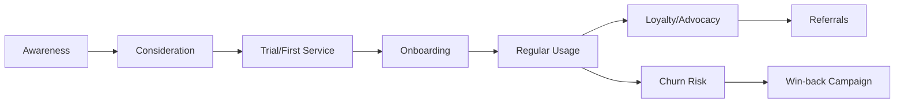
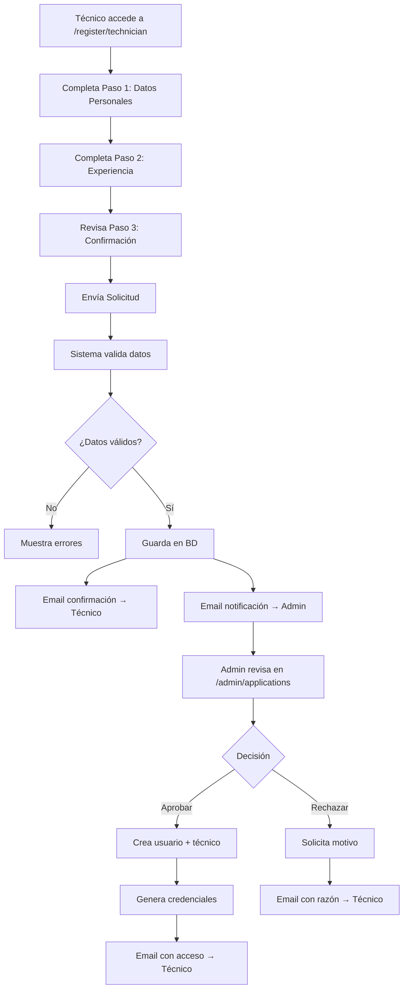

# 🚀 ROADMAP DE MEJORAS - TIENDA SERVICIO TÉCNICO

**📅 Fecha de creación:** 8 de octubre de 2025
**🎯 Objetivo:** Expansión y optimización del portal después de la implementación exitosa
**📊 Estado base:** Portal del Cliente 100% funcional - 8 páginas completadas

---

## 🎯 **OVERVIEW ESTRATÉGICO**

Con el **Portal del Cliente completamente implementado**, es momento de escalar hacia una plataforma integral que combine **automatización**, **seguridad avanzada**, **comunicación omnicanal** y **optimización comercial**.

### **🚀 Visión a 12 meses**

Convertir la plataforma actual en un ecosistema completo de servicio técnico que integre CRM, automatización, comunicación multi-canal y herramientas comerciales avanzadas.

---

## 🔐 **1. SEGURIDAD Y AUTENTICACIÓN AVANZADA**

### **📱 Autenticación Multi-Factor (2FA/MFA)**

**Prioridad:** 🔴 ALTA
**Tiempo estimado:** 2-3 semanas
**Beneficios:** Seguridad robusta, cumplimiento empresarial

**Implementación sugerida:**

```typescript
// Integración con authenticator apps
- Google Authenticator
- Microsoft Authenticator
- Authy

// Métodos adicionales
- SMS con código OTP
- Email con tokens temporales
- Autenticación biométrica (móvil)
- Llaves de seguridad físicas (FIDO2)
```

**Casos de uso prioritarios:**

- ✅ Acceso a datos financieros (facturas, pagos)
- ✅ Cambios de información personal crítica
- ✅ Solicitudes de garantía de alto valor
- ✅ Acceso desde dispositivos nuevos

### **🛡️ Gestión Avanzada de Sesiones**

**Prioridad:** 🟡 MEDIA
**Tiempo estimado:** 1-2 semanas

**Funcionalidades:**

- **Sesiones activas** - Ver todos los dispositivos conectados
- **Logout remoto** - Cerrar sesión desde dispositivos específicos
- **Alertas de seguridad** - Notificaciones de accesos inusuales
- **Geolocalización** - Tracking de ubicaciones de acceso
- **Tiempo de sesión configurable** - Auto-logout por inactividad

---

## 📧 **2. VALIDACIÓN DE CORREOS Y COMUNICACIÓN**

### **✉️ Sistema de Validación de Email Avanzado**

**Prioridad:** 🔴 ALTA
**Tiempo estimado:** 1-2 semanas

**Implementación técnica:**

```typescript
// Proveedores sugeridos
- SendGrid (reliability + analytics)
- Amazon SES (costo-efectivo)
- Mailgun (developer-friendly)

// Tipos de email implementar
interface EmailTemplates {
  welcome: 'Bienvenida con onboarding'
  serviceConfirmed: 'Confirmación de cita'
  technicianEnRoute: 'Técnico en camino'
  serviceCompleted: 'Servicio completado'
  warrantyAlert: 'Garantía por vencer'
  paymentReminder: 'Recordatorio de pago'
  promotionalOffer: 'Ofertas personalizadas'
}
```

**Validaciones implementar:**

- **Syntax validation** - Formato correcto del email
- **Domain validation** - Verificar existencia del dominio
- **MX record check** - Servidor de correo funcional
- **Disposable email detection** - Bloquear emails temporales
- **Role-based email detection** - Identificar emails corporativos

### **📱 Integración SMS/WhatsApp Business**

**Prioridad:** 🔴 ALTA
**Tiempo estimado:** 2-3 semanas

**Proveedores recomendados:**

```javascript
// SMS Providers
- Twilio (global leader)
- AWS SNS (integración AWS)
- ClickSend (costo-efectivo)

// WhatsApp Business API
- Meta WhatsApp Business Platform
- 360Dialog (partner oficial)
- Twilio WhatsApp API
```

**Casos de uso SMS/WhatsApp:**

- 🔔 **Confirmaciones inmediatas** - Citas agendadas
- 📍 **Tracking en tiempo real** - "Su técnico llegará en 15 min"
- ⚠️ **Alertas críticas** - Cambios de cita, emergencias
- 🎁 **Ofertas flash** - Promociones por tiempo limitado
- 📋 **Recordatorios automáticos** - Citas próximas, pagos pendientes

---

## 🤖 **3. AUTOMATIZACIÓN INTELIGENTE**

### **🔄 Workflows Automatizados**

**Prioridad:** 🔴 ALTA
**Tiempo estimado:** 3-4 semanas

**Engine de automatización sugerido:**

```typescript
// Zapier integrations
- Conectar con +5000 apps
- Triggers personalizados
- Workflows complejos

// Custom automation engine
interface AutomationRule {
  trigger: 'service_completed' | 'warranty_expires' | 'payment_due'
  conditions: string[]
  actions: Action[]
  schedule?: CronExpression
}

// Ejemplos de workflows
const workflows = [
  {
    name: 'Post-Service Follow-up',
    trigger: 'service_completed',
    wait: '24_hours',
    actions: [
      'send_survey_email',
      'schedule_warranty_reminder',
      'update_crm_status'
    ]
  },
  {
    name: 'Warranty Expiration Alert',
    trigger: 'warranty_7_days_left',
    actions: [
      'send_sms_alert',
      'email_renewal_offer',
      'create_sales_opportunity'
    ]
  }
]
```

### **🎯 Marketing Automation**

**Prioridad:** 🟡 MEDIA
**Tiempo estimado:** 2-3 semanas

**Campañas automáticas:**

- **Onboarding sequence** - Serie de emails para nuevos clientes
- **Re-engagement** - Clientes inactivos >90 días
- **Upselling inteligente** - Basado en historial de servicios
- **Seasonal campaigns** - Mantenimientos pre-invierno, etc.
- **Birthday/Anniversary** - Ofertas personalizadas en fechas especiales

### **📊 Reportes Automáticos**

**Prioridad:** 🟡 MEDIA
**Tiempo estimado:** 1-2 semanas

**Dashboard de métricas en tiempo real:**

```typescript
interface AutoReports {
  daily: {
    services_completed: number
    revenue_generated: number
    customer_satisfaction: number
    technician_utilization: number
  }
  weekly: {
    growth_metrics: object
    top_performing_technicians: array
    most_requested_services: array
    warranty_claims_analysis: object
  }
  monthly: {
    business_intelligence: object
    predictive_analytics: object
    customer_lifetime_value: object
  }
}
```

---

## 💬 **4. CHAT EN VIVO Y COMUNICACIÓN**

### **🗨️ Live Chat Integrado**

**Prioridad:** 🔴 ALTA
**Tiempo estimado:** 2-3 semanas

**Soluciones recomendadas:**

```typescript
// Tier 1 - Premium
- Intercom (líder del mercado)
- Zendesk Chat (enterprise-ready)
- Drift (sales-focused)

// Tier 2 - Costo-efectivo
- Crisp (feature-rich)
- Tidio (small business friendly)
- Chaport (unlimited chats)

// Custom solution
- Socket.io + React
- Firebase Realtime Database
- WebRTC para video calls
```

**Funcionalidades clave:**

- ✅ **Chat proactivo** - Trigger automático basado en comportamiento
- ✅ **Routing inteligente** - Direccionar a especialista correcto
- ✅ **Historial unificado** - Ver conversaciones anteriores
- ✅ **Transferencia de archivos** - Fotos de electrodomésticos
- ✅ **Co-browsing** - Asistencia visual en el portal
- ✅ **Video llamadas** - Diagnóstico remoto

### **🤖 Chatbot con IA**

**Prioridad:** 🟡 MEDIA
**Tiempo estimado:** 3-4 semanas

**Implementación sugerida:**

```javascript
// AI Platforms
- OpenAI GPT-4 (conversacional avanzado)
- Dialogflow (Google, robusto)
- Rasa (open source, customizable)
- Microsoft Bot Framework

// Knowledge base integration
const botCapabilities = [
  'Responder FAQ comunes',
  'Diagnosticar problemas básicos',
  'Agendar citas disponibles',
  'Consultar estado de servicios',
  'Procesar reclamos de garantía',
  'Escalar a humano cuando necesario'
]
```

**Casos de uso inteligentes:**

- 🔍 **Diagnóstico inicial** - "Describe el problema de tu lavadora"
- 📅 **Agendamiento automático** - "¿Cuándo te conviene la visita?"
- 📋 **Seguimiento de órdenes** - "Tu servicio está programado para mañana a las 2pm"
- 🎓 **Tutoriales interactivos** - "Te ayudo a resetear tu electrodoméstico"

---

## 🎨 **5. CALL-TO-ACTION Y OPTIMIZACIÓN DE CONVERSIONES**

### **📈 CTA Optimization System**

**Prioridad:** 🔴 ALTA
**Tiempo estimado:** 1-2 semanas

**A/B Testing Framework:**

```typescript
interface CTAVariant {
  id: string
  text: string
  color: 'primary' | 'secondary' | 'success' | 'warning'
  size: 'sm' | 'md' | 'lg'
  position: 'header' | 'sidebar' | 'footer' | 'floating'
  urgency: 'low' | 'medium' | 'high'
}

// Ejemplos de CTAs optimizados
const ctaVariants = [
  {
    context: 'homepage_hero',
    variants: [
      '🔧 Solicitar Servicio Ahora',
      '⚡ Servicio en 24h - Reservar',
      '🎯 Agendar Cita Gratis',
      '💯 Garantía Total - Empezar',
    ],
  },
  {
    context: 'service_completed',
    variants: [
      '⭐ Calificar Servicio',
      '💝 ¿Te gustó? ¡Califícanos!',
      '🎁 Califica y obtén 10% descuento',
      '📝 Comparte tu experiencia',
    ],
  },
]
```

### **🏷️ Promociones Dinámicas**

**Prioridad:** 🟡 MEDIA
**Tiempo estimado:** 2 semanas

**Sistema de ofertas inteligentes:**

- **Time-sensitive banners** - Ofertas que cambian según hora/día
- **Personalized offers** - Basadas en historial del cliente
- **Inventory-based** - Promociones según disponibilidad de técnicos
- **Weather-triggered** - Ofertas de A/C en días calurosos
- **Competition-aware** - Ajustes según precios del mercado

### **📊 Conversion Analytics**

**Prioridad:** 🟡 MEDIA
**Tiempo estimado:** 1 semana

**Métricas de conversión a trackear:**

```typescript
interface ConversionMetrics {
  homepage_to_request: number // % que solicita servicio
  browse_to_purchase: number // % que compra productos
  chat_to_conversion: number // % que convierte post-chat
  email_click_through: number // % CTR en campañas
  mobile_vs_desktop: object // Rendimiento por dispositivo
  funnel_dropoff_points: array // Dónde pierden usuarios
}
```

---

## 📊 **6. CRM Y GESTIÓN DE CLIENTES**

### **🎯 CRM Integrado Completo**

**Prioridad:** 🔴 ALTA
**Tiempo estimado:** 4-5 semanas

**Arquitectura sugerida:**

```typescript
// CRM Solutions to integrate
- HubSpot (free tier + paid features)
- Salesforce (enterprise-grade)
- Pipedrive (sales-focused)
- Custom CRM with Strapi/Supabase

interface CustomerProfile {
  // Datos básicos
  basic: PersonalInfo

  // Behavioral data
  engagement: {
    last_login: Date
    pages_visited: string[]
    time_on_site: number
    email_open_rate: number
    chat_sessions: number
  }

  // Transactional data
  services: {
    total_spent: number
    average_order_value: number
    service_frequency: number
    preferred_technicians: string[]
    preferred_time_slots: string[]
  }

  // Predictive data
  analytics: {
    churn_risk: 'low' | 'medium' | 'high'
    lifetime_value: number
    next_service_prediction: Date
    upselling_opportunities: string[]
  }
}
```

### **📈 Customer Journey Mapping**

**Prioridad:** 🟡 MEDIA
**Tiempo estimado:** 2-3 semanas

**Etapas del customer journey:**



**Touchpoints automatizados:**

- **Pre-service** - Confirmaciones, preparación, expectativas
- **During service** - Updates en tiempo real, comunicación
- **Post-service** - Follow-up, survey, garantía info
- **Long-term** - Maintenance reminders, loyalty rewards

### **🎁 Programa de Fidelización**

**Prioridad:** 🟡 MEDIA
**Tiempo estimado:** 3 semanas

**Sistema de puntos y recompensas:**

```typescript
interface LoyaltyProgram {
  tiers: {
    bronze: { min_services: 0; discount: 0; benefits: string[] }
    silver: { min_services: 5; discount: 5; benefits: string[] }
    gold: { min_services: 15; discount: 10; benefits: string[] }
    platinum: { min_services: 30; discount: 15; benefits: string[] }
  }

  point_earning: {
    service_completion: 100
    referral_success: 500
    review_left: 50
    social_share: 25
  }

  redemption_options: {
    discount_service: 500
    free_maintenance: 1000
    priority_booking: 200
    extended_warranty: 800
  }
}
```

---

## 🔧 **7. MEJORAS TÉCNICAS Y INFRAESTRUCTURA**

### **⚡ Performance Optimization**

**Prioridad:** 🔴 ALTA
**Tiempo estimado:** 2-3 semanas

**Optimizaciones sugeridas:**

```typescript
// Frontend optimizations
- Code splitting por ruta
- Lazy loading de componentes pesados
- Image optimization con Next.js
- Service Worker para caching
- Bundle analysis y tree shaking

// Backend optimizations
- Redis para caching de sesiones
- Database indexing optimization
- API response compression
- CDN para assets estáticos
- Database connection pooling
```

### **📱 Progressive Web App (PWA)**

**Prioridad:** 🟡 MEDIA
**Tiempo estimado:** 2-3 semanas

**Funcionalidades PWA:**

- **Offline functionality** - Cache de datos críticos
- **Push notifications** - Alertas nativas del dispositivo
- **App-like experience** - Installable en móviles
- **Background sync** - Sincronización cuando vuelve conexión
- **Native device integration** - Cámara, GPS, contactos

### **🌐 Multi-tenant Architecture**

**Prioridad:** 🟢 BAJA
**Tiempo estimado:** 6-8 semanas

**Preparación para franquicias:**

```typescript
interface TenantConfig {
  subdomain: string // bogota.serviciotecnico.com
  branding: {
    logo: string
    colors: ColorPalette
    custom_css: string
  }
  features: {
    enabled_modules: string[]
    pricing_tiers: object
    local_integrations: object
  }
  localization: {
    currency: string
    timezone: string
    language: string
  }
}
```

---

## 📍 **8. INTEGRACIONES GEOGRÁFICAS Y LOGÍSTICAS**

### **🗺️ Google Maps Integration Avanzada**

**Prioridad:** 🔴 ALTA
**Tiempo estimado:** 2-3 semanas

**Funcionalidades geográficas:**

```typescript
// Maps features to implement
- Real-time technician tracking
- Route optimization for multiple stops
- Service area visualization
- Distance-based pricing
- ETA calculations with traffic
- Geofencing for service areas

interface LocationFeatures {
  customer_tracking: boolean    // "Su técnico está a 10 min"
  route_optimization: boolean   // Rutas eficientes para técnicos
  service_areas: boolean        // Zonas de cobertura dinámicas
  distance_pricing: boolean     // Precios por distancia
  traffic_awareness: boolean    // ETAs con tráfico real
}
```

### **📦 Inventory Management**

**Prioridad:** 🟡 MEDIA
**Tiempo estimado:** 3-4 semanas

**Sistema de inventario inteligente:**

- **Real-time stock** - Niveles de repuestos por técnico
- **Automatic reordering** - Pedidos automáticos de partes
- **Predictive stocking** - Basado en servicios programados
- **Mobile inventory** - App para técnicos para registrar uso
- **Cost tracking** - Margen de ganancia por servicio

---

## 💰 **9. SISTEMA DE PAGOS Y FINANZAS**

### **💳 Gateway de Pagos Completo**

**Prioridad:** 🔴 ALTA
**Tiempo estimado:** 3-4 semanas

**Métodos de pago sugeridos:**

```typescript
// Colombian payment methods
interface PaymentOptions {
  credit_cards: ['Visa', 'Mastercard', 'American Express']
  debit_cards: ['Débito Visa', 'Débito Mastercard']
  digital_wallets: ['Nequi', 'Daviplata', 'PSE']
  bank_transfers: ['PSE', 'Transferencia bancaria']
  cash_on_delivery: boolean
  installments: {
    max_installments: 36
    interest_free: 3
    minimum_amount: 100000
  }
}

// Payment providers for Colombia
const providers = [
  'PayU (líder local)',
  'MercadoPago (expansión)',
  'ePayco (especialista local)',
  'PlacetoPay (cobertura amplia)',
  'Wompi (tecnología moderna)',
]
```

### **📊 Financial Analytics**

**Prioridad:** 🟡 MEDIA
**Tiempo estimado:** 2 semanas

**Dashboard financiero:**

- **Revenue tracking** - Ingresos diarios/semanales/mensuales
- **Payment method analysis** - Qué prefieren usar los clientes
- **Refund management** - Manejo de devoluciones automático
- **Commission tracking** - Comisiones por técnico/vendedor
- **Tax compliance** - IVA y retenciones automáticas

---

## 🎯 **10. CRONOGRAMA DE IMPLEMENTACIÓN**

### **🚀 FASE 1: SEGURIDAD Y COMUNICACIÓN (Mes 1)**

```
Semana 1-2:
✅ Implementar 2FA/MFA
✅ Validación avanzada de emails
✅ Configurar SendGrid/SES

Semana 3-4:
✅ Integración SMS/WhatsApp
✅ Sistema de sesiones avanzado
✅ Live chat básico (Crisp/Tidio)
```

### **🤖 FASE 2: AUTOMATIZACIÓN Y CTA (Mes 2)**

```
Semana 5-6:
✅ Engine de automatización básico
✅ Workflows post-servicio
✅ A/B testing para CTAs

Semana 7-8:
✅ Marketing automation
✅ Chatbot con IA básica
✅ Conversion analytics
```

### **📊 FASE 3: CRM Y PAGOS (Mes 3)**

```
Semana 9-10:
✅ CRM integrado (HubSpot free)
✅ Customer journey mapping
✅ Gateway de pagos completo

Semana 11-12:
✅ Programa de fidelización
✅ Financial analytics
✅ Google Maps integration
```

### **⚡ FASE 4: OPTIMIZACIÓN Y PWA (Mes 4)**

```
Semana 13-14:
✅ Performance optimization
✅ PWA implementation
✅ Inventory management básico

Semana 15-16:
✅ Testing completo
✅ Documentation final
✅ Launch preparation
```

---

## 💰 **11. ESTIMACIÓN DE COSTOS**

### **💸 Costos de Desarrollo**

| Funcionalidad      | Tiempo | Costo Dev | Herramientas | Total Mes |
| ------------------ | ------ | --------- | ------------ | --------- |
| 🔐 Seguridad (2FA) | 3 sem  | $1,500    | $50          | $1,550    |
| 📧 Email/SMS       | 2 sem  | $1,000    | $200         | $1,200    |
| 🤖 Automatización  | 4 sem  | $2,000    | $300         | $2,300    |
| 💬 Live Chat       | 3 sem  | $1,500    | $500         | $2,000    |
| 📊 CRM             | 4 sem  | $2,000    | $800         | $2,800    |
| 💳 Pagos           | 3 sem  | $1,500    | $100         | $1,600    |
| ⚡ Performance     | 2 sem  | $1,000    | $100         | $1,100    |

**💡 Total estimado: $12,550 USD para implementación completa**

### **📅 Costos Operacionales Mensuales**

```
🔐 Seguridad:
- Auth0/Firebase Auth: $25/mes
- SSL Certificates: $10/mes

📧 Comunicación:
- SendGrid: $90/mes (40K emails)
- Twilio SMS: $50/mes (500 SMS)
- WhatsApp Business: $80/mes

🤖 Automatización:
- Zapier Professional: $50/mes
- OpenAI API: $100/mes

💬 Chat:
- Crisp Pro: $25/mes
- Video calls: $30/mes

📊 Analytics:
- Google Analytics 4: $0 (free)
- Mixpanel: $25/mes

💳 Pagos:
- Payment gateway: 2.9% + $0.30 por transacción

💻 Hosting:
- Vercel Pro: $20/mes
- Database: $25/mes
- CDN: $15/mes

Total mensual: ~$545/mes + comisiones de pago
```

---

## 📊 **12. ROI ESPERADO Y MÉTRICAS DE ÉXITO**

### **📈 Métricas de Impacto**

```typescript
interface BusinessMetrics {
  // Efficiency gains
  customer_self_service_rate: '85%' // Reducción de llamadas
  booking_automation: '70%' // Citas automáticas
  follow_up_automation: '95%' // Follow-ups automáticos

  // Revenue impact
  conversion_rate_improvement: '25%' // Mejor CTA y UX
  average_order_value_increase: '15%' // Upselling inteligente
  customer_retention_rate: '90%' // Programa fidelización

  // Cost savings
  support_cost_reduction: '40%' // Menos llamadas/emails
  marketing_efficiency: '60%' // Targeting mejor
  operational_efficiency: '30%' // Automatización
}
```

### **🎯 KPIs de Éxito por Trimestre**

**Q1 (Meses 1-3):**

- ✅ 2FA adoption rate: >80%
- ✅ Email open rate: >35%
- ✅ SMS response rate: >60%
- ✅ Live chat satisfaction: >4.5/5

**Q2 (Meses 4-6):**

- ✅ Automation coverage: >70% workflows
- ✅ CRM data completeness: >90%
- ✅ Payment success rate: >98%
- ✅ Customer retention: >85%

**Q3 (Meses 7-9):**

- ✅ PWA install rate: >40%
- ✅ Mobile conversion rate: >15%
- ✅ Loyalty program enrollment: >60%
- ✅ Referral rate: >20%

---

## 🛡️ **13. CONSIDERACIONES DE SEGURIDAD Y COMPLIANCE**

### **🔒 Security Best Practices**

```typescript
// Security checklist
interface SecurityCompliance {
  data_protection: {
    encryption_at_rest: boolean // AES-256
    encryption_in_transit: boolean // TLS 1.3
    data_anonymization: boolean // GDPR compliance
    backup_encryption: boolean // Encrypted backups
  }

  access_control: {
    role_based_access: boolean // RBAC implementation
    principle_of_least_privilege: boolean
    session_management: boolean // Secure sessions
    audit_logging: boolean // All actions logged
  }

  compliance: {
    gdpr_ready: boolean // European compliance
    ley_1581_colombia: boolean // Colombian data law
    pci_dss: boolean // Payment compliance
    iso_27001_aligned: boolean // Security standards
  }
}
```

### **📋 Compliance Checklist**

**Ley 1581 de 2012 (Colombia):**

- ✅ Consentimiento explícito para datos
- ✅ Derecho al olvido implementado
- ✅ Portabilidad de datos
- ✅ Notificación de brechas

**GDPR (si aplica):**

- ✅ Privacy by design
- ✅ Data minimization
- ✅ Consent management
- ✅ Right to erasure

---

## 🎉 **14. CONCLUSIONES Y RECOMENDACIONES**

### **🚀 Prioridades Inmediatas (30 días)**

1. **🔐 Implementar 2FA** - Seguridad crítica
2. **📧 Email/SMS validation** - Comunicación confiable
3. **💬 Live chat básico** - Soporte inmediato
4. **🎯 CTA optimization** - Mejorar conversiones

### **📈 Impacto Esperado**

Con estas mejoras, el proyecto evolucionará de:

- **Portal funcional** → **Ecosistema completo**
- **Servicio reactivo** → **Automatización proactiva**
- **Comunicación básica** → **Omnichannel experience**
- **Ventas ocasionales** → **Revenue optimization**

### **💡 Recomendación Final**

**Implementar en fases**, priorizando seguridad y comunicación primero, seguido de automatización y optimización comercial. El ROI esperado justifica la inversión total en un horizonte de 6-12 meses.

---


**📅 Roadmap creado:** 8 de octubre de 2025
**🔄 Última actualización:** 7 de enero de 2026
**🎯 Válido hasta:** 8 de octubre de 2026
**👨‍💻 Preparado por:** Sistema de IA con análisis estratégico
**📊 Status:** Listo para implementación por fases

---

## 🆕 **14. SISTEMA DE REGISTRO DE TÉCNICOS** ✅ IMPLEMENTADO

**Fecha de implementación:** 7 de enero de 2026
**Estado:** ✅ Completado (Pendiente de configuración final)
**Prioridad:** 🔴 ALTA

### **📋 Resumen de Implementación**

Se ha implementado un sistema completo de registro de técnicos con aprobación administrativa que permite:

1. **Registro público de técnicos** mediante formulario multi-paso
2. **Revisión administrativa** de solicitudes
3. **Aprobación/Rechazo** con generación automática de credenciales
4. **Notificaciones por email** en cada etapa del proceso

### **✅ Componentes Implementados**

#### **1. Base de Datos**
- ✅ Modelo `TechnicianApplication` en Prisma
- ✅ Validaciones con Zod
- ✅ Índices para optimización de consultas

#### **2. Formulario Público** (`/register/technician`)
- ✅ Diseño multi-paso (3 pasos)
- ✅ Validación en tiempo real
- ✅ 10 especialidades disponibles
- ✅ 21 ciudades colombianas
- ✅ Prevención de duplicados (cédula y email)
- ✅ Pantalla de confirmación

#### **3. APIs Backend**
- ✅ `POST /api/technician/apply` - Recibir solicitudes
- ✅ `GET /api/admin/applications` - Listar solicitudes
- ✅ `POST /api/admin/applications/:id/approve` - Aprobar
- ✅ `POST /api/admin/applications/:id/reject` - Rechazar

#### **4. Panel de Administración** (`/admin/applications`)
- ✅ Vista de solicitudes con filtros
- ✅ Estadísticas (Pendientes/Aprobadas/Rechazadas)
- ✅ Diálogos de aprobación/rechazo
- ✅ Vista detallada de cada solicitud
- ✅ Generación automática de credenciales

#### **5. Sistema de Emails**
- ✅ Confirmación al solicitante
- ✅ Notificación al administrador
- ✅ Email de aprobación con credenciales
- ✅ Email de rechazo con motivo

### **⚠️ TAREAS PENDIENTES - CONFIGURACIÓN FINAL**

#### **🔴 CRÍTICO - Ejecutar Migración de Base de Datos**

```bash
# 1. Detener el servidor de desarrollo
Ctrl+C

# 2. Ejecutar migración
pnpm db:push

# 3. Reiniciar servidor
pnpm run dev
```

**Resultado esperado:**
- Creación de tabla `technician_applications`
- Actualización del cliente de Prisma
- Eliminación de errores de TypeScript

#### **🔴 CRÍTICO - Configurar Variables de Entorno**

Agregar/verificar en `.env.local`:

```env
# Email Service (Resend)
RESEND_API_KEY=tu_api_key_de_resend
FROM_EMAIL=noreply@somostecnicos.com
# Otras credenciales
ADMIN_EMAIL=admin.demo@somostecnicos.com

# Application URL
NEXT_PUBLIC_APP_URL=http://localhost:3000
```

**Pasos para obtener RESEND_API_KEY:**
1. Crear cuenta en [resend.com](https://resend.com)
2. Verificar dominio de email
3. Generar API Key
4. Agregar a `.env.local`

#### **🟡 OPCIONAL - Mejoras Futuras**

##### **1. Upload de Documentos**
**Prioridad:** 🟡 MEDIA
**Tiempo estimado:** 1-2 semanas

```typescript
// Implementar upload de:
- Foto de cédula (frente y reverso)
- Certificados de capacitación
- Foto de perfil
- Referencias laborales

// Proveedores sugeridos:
- Cloudinary (free tier generoso)
- AWS S3 (escalable)
- Uploadthing (Next.js friendly)
```

##### **2. Sistema de Comentarios**
**Prioridad:** 🟢 BAJA
**Tiempo estimado:** 1 semana

- Permitir al admin agregar notas internas
- Historial de cambios de estado
- Timeline de revisión

##### **3. Notificaciones Push**
**Prioridad:** 🟡 MEDIA
**Tiempo estimado:** 1 semana

- Notificaciones en tiempo real para admin
- Badge counter de solicitudes pendientes
- Sonido de alerta para nuevas solicitudes

##### **4. Dashboard de Métricas**
**Prioridad:** 🟢 BAJA
**Tiempo estimado:** 1 semana

```typescript
interface ApplicationMetrics {
  total_applications: number
  approval_rate: number
  average_review_time: number
  applications_by_city: object
  popular_specialties: array
  monthly_trend: array
}
```

##### **5. Integración con Verificación de Identidad**
**Prioridad:** 🟢 BAJA
**Tiempo estimado:** 2-3 semanas

- API de validación de cédulas (Registraduría)
- Verificación de antecedentes
- Validación de certificaciones

### **🧪 Pruebas del Sistema**

#### **Checklist de Validación**

```markdown
[ ] Migración de BD ejecutada exitosamente
[ ] Variables de entorno configuradas
[ ] Formulario público accesible en /register/technician
[ ] Formulario completa los 3 pasos sin errores
[ ] Email de confirmación recibido por solicitante
[ ] Email de notificación recibido por admin
[ ] Panel admin muestra solicitudes en /admin/applications
[ ] Filtros funcionan correctamente
[ ] Aprobación genera credenciales y envía email
[ ] Rechazo requiere motivo y envía email
[ ] Credenciales generadas permiten login exitoso
[ ] Técnico aprobado aparece en tabla technicians
[ ] Técnico aprobado aparece en tabla admin_users
```

#### **Datos de Prueba Sugeridos**

```javascript
// Solicitud de prueba
{
  nombre: "Juan",
  apellido: "Pérez",
  cedula: "1234567890",
  email: "juan.perez.test@example.com",
  telefono: "3001234567",
  direccion: "Calle 123 #45-67",
  ciudad: "Bogotá",
  especialidades: ["nevera", "lavadora"],
  zonaPreferida: "Norte",
  experienciaAnios: 5
}
```

### **📊 Flujo Completo del Sistema**



### **💡 Beneficios del Sistema**

#### **Para el Negocio**
- ✅ **Control total** sobre quién accede como técnico
- ✅ **Validación de identidad** antes de dar acceso
- ✅ **Prevención de fraudes** mediante verificación
- ✅ **Auditoría completa** del proceso de registro
- ✅ **Escalabilidad** para crecimiento del equipo

#### **Para los Técnicos**
- ✅ **Proceso claro** y profesional
- ✅ **Transparencia** en el estado de solicitud
- ✅ **Comunicación automática** en cada etapa
- ✅ **Credenciales seguras** generadas automáticamente

#### **Para los Administradores**
- ✅ **Panel centralizado** de gestión
- ✅ **Filtros y búsqueda** eficientes
- ✅ **Decisiones informadas** con datos completos
- ✅ **Automatización** de tareas repetitivas

### **🎯 Próximos Pasos Recomendados**

1. **Inmediato** (Esta semana)
   - [ ] Ejecutar migración de BD
   - [ ] Configurar variables de entorno
   - [ ] Probar flujo completo
   - [ ] Documentar credenciales de prueba

2. **Corto Plazo** (Próximo mes)
   - [ ] Implementar upload de documentos
   - [ ] Agregar notificaciones push
   - [ ] Crear dashboard de métricas

3. **Mediano Plazo** (Próximos 3 meses)
   - [ ] Integrar verificación de identidad
   - [ ] Sistema de comentarios internos
   - [ ] Exportación de reportes

---

